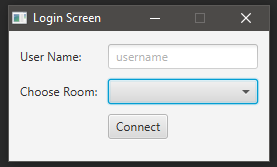
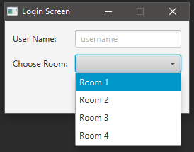
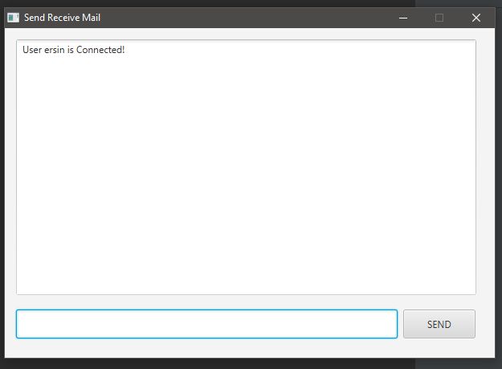
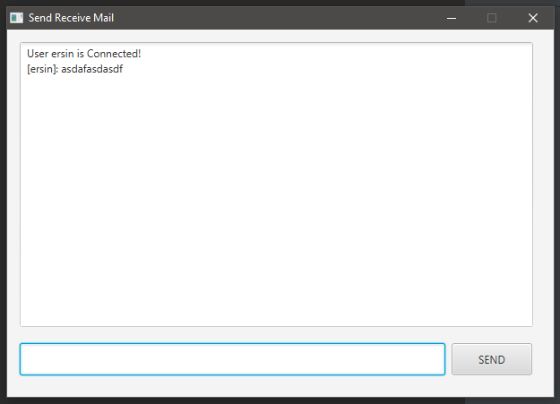

# javafxChatRoom
This is a simple client chat application over server connection.
# Getting Started
Follow the instruction below to use application.
1. Run file under server

2. Run app file under chatpanel

3. Enter your username  and choose room you wanna connect to, on the opened panel

4. Click to connect

 

 

 

## Authors
- [Ersin ÇEBİ](https://github.com/ersincebi)
- [Şükrü Zafer Kalyoncu](https://github.com/zaferkalyoncu)
    
## License

This project is licensed under the MIT License - see the [LICENSE](LICENSE) file for details